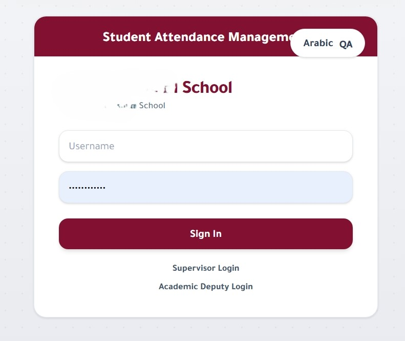
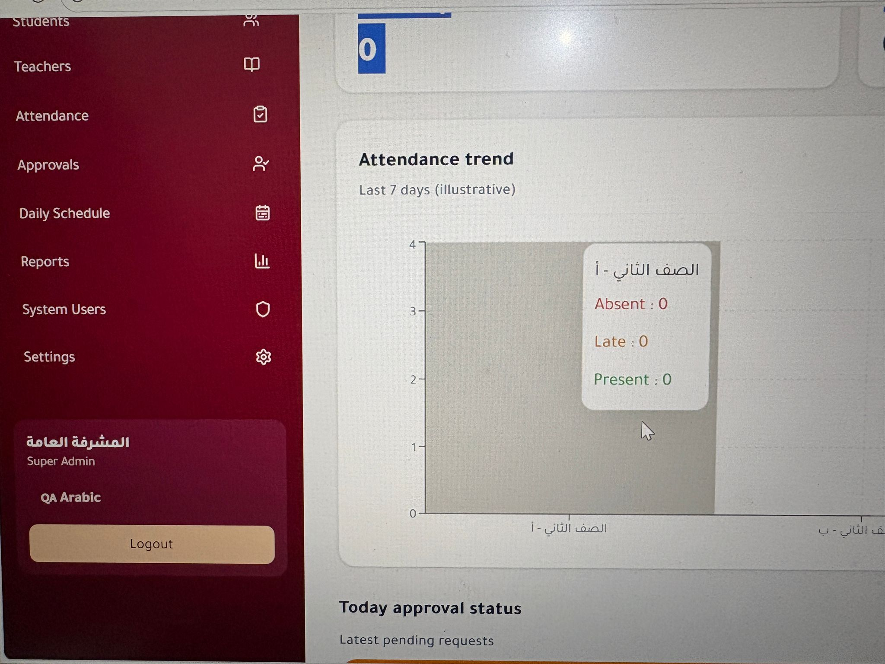

# 🚀 Full Stack Developer Portfolio

I am a Full Stack Web & Mobile Developer specializing in building scalable, real-world systems using modern technologies.

This portfolio showcases production-level projects including a School Management System, POS System, and a Mobile Stadium Booking App.

---

# 🏫 1. School Management System (for Students)

A complete system for managing schools with roles, attendance, scheduling, and student/teacher portals.

## 🔑 Key Features
- Multi-role system (Super Admin, Academic Supervisor, HR, Teacher, Student)
- Secure authentication using JWT
- Student & teacher account management with email-based portal access
- Flexible password system (auto-generated or custom)
- Attendance tracking with approval workflow
- Student portal (dashboard, attendance history, schedule)
- Soft delete system for safe data management
- Bulk account activation tools for admins
- File uploads (absences, documents)
- Multi-language support (Arabic / English)
- Real-time notifications (Email / WhatsApp)
- Background jobs (Cron scheduling)

## 🛠 Tech Stack
- Backend: Node.js, Express.js
- Database: PostgreSQL + Prisma ORM
- Validation: Zod
- Frontend: React.js + React Query
- Authentication: JWT

---

# 🏟️ 2. Stadium Booking App (Flutter)

A mobile application for booking sports fields in Qatar with a modern UI and Arabic-first design.

## 🔑 Key Features
- Splash screen with smart navigation
- Onboarding screens (first-time only)
- Authentication (Login / Register / Logout)
- Home dashboard with filtering by city
- Match details with team info and attendance status
- Booking management (Upcoming / Completed / Cancelled)
- Player profile system
- Account settings with local data persistence
- Offline-ready local storage

## 🛠 Tech Stack
- Flutter (Dart)
- Shared Preferences (Local Storage)
- Material 3 Design
- Google Fonts (Cairo)
- Flutter Localization (AR/EN)

---

# 💰 3. POS System (Point of Sale)

A complete sales and inventory management system for stores and businesses.

## 🔑 Key Features
- Product management (Add / Edit / Delete)
- Inventory tracking system
- Sales and invoices generation
- Supplier management
- Financial and sales reports
- Dashboard overview for business analytics
- Secure role-based access

## 🛠 Tech Stack
- Node.js / Express
- Database: SQL / MongoDB (based on implementation)
- REST API Architecture
- Frontend (if applicable): React / Web UI

---

# 💡 Highlights

- Real-world production-level projects
- Clean architecture and scalable backend design
- Strong focus on UX/UI and system logic
- Multi-platform development (Web + Mobile)
- Security-first approach (JWT, role-based access)

---

# 👨‍💻 Developer

Full Stack Developer specialized in:
- Node.js
- JavaScript
- React
- Flutter
- REST APIs
- Database Design

Focused on building scalable, clean, and real-world applications.# full-stack-portfolio
Showcase of full-stack projects including booking system, POS system, and e-learning platform.
